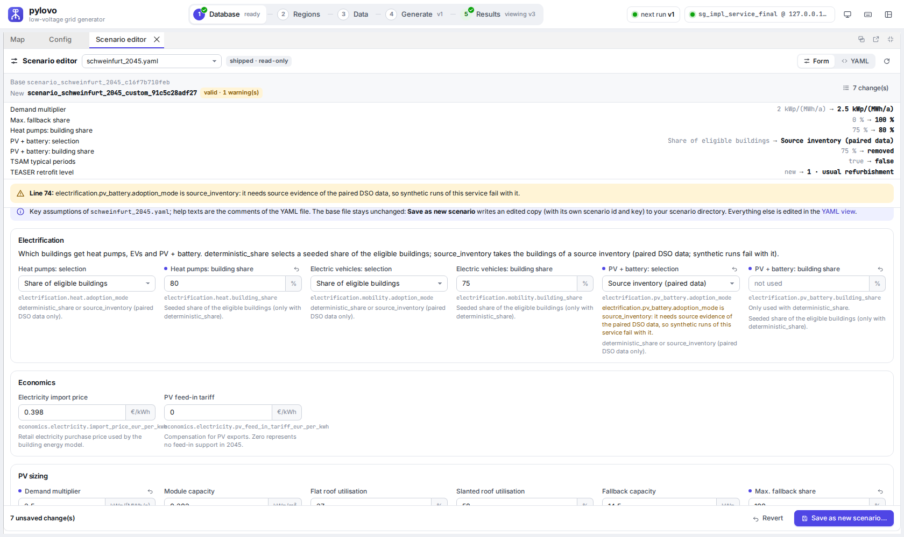

# GridExpand service and pylovo-ui plugin

`gridexpand serve` runs a small web service: a **job API** that starts the ordinary synthetic
pipeline (`gridexpand run`) as subprocesses, **read endpoints** for expansion analyses and
power-flow summaries, and the **plugin panels** that pylovo-ui loads (one UI for "generate LV grids,
then allocate loads, optimise, run power flow and analyse grid expansion"). The composition of both
tools (proxy, images, compose) lives in the GridPlanner repository.


## Run it

```bash
uv sync --extra service
uv run gridexpand serve                      # http://127.0.0.1:18766/  (API docs: /docs)
uv run pylovo-ui --plugin gridexpand=http://127.0.0.1:18766/   # in the pylovo checkout (development)
```

The plugin loader of pylovo-ui (`--plugin NAME=BASE`) is on the pylovo branch `fable/ui-plugins-dev-review`
(not yet merged).

For the cross-origin development setup above start the service with
`GRIDEXPAND_UI_CORS_ORIGINS=http://127.0.0.1:8765`. Behind a reverse proxy (GridPlanner) use
`--root-path /gridexpand --allowed-host 127.0.0.1:18780`. Options: `--host`, `--port`, `--root-path`,
`--allowed-host` (repeatable), `--scenario-dir` (repeatable), `--user-scenario-dir`, `--max-running-jobs`,
`--log-level`. Environment: `GRIDEXPAND_SOLVER` (passed to the jobs), `GRIDEXPAND_SERVICE_SCENARIO_DIRS`
(`os.pathsep`-separated extra scenario folders), `GRIDEXPAND_SERVICE_USER_SCENARIO_DIR` (where the scenario
editor saves, default `WORK_DIR/scenarios`), `GRIDEXPAND_UI_CORS_ORIGINS` (development only), and the usual
`GRIDEXPAND_ENV_FILE` / `GRIDEXPAND_WORK_DIR`.

**Safety.** The service starts jobs that write to the database of GridExpand's `.env`. It binds to
`127.0.0.1`, accepts only the `Host` headers `127.0.0.1:<port>`, `localhost:<port>` and the
`--allowed-host` values (DNS rebinding), and refuses every state-changing request without the header
`X-GridExpand-UI: 1` (CSRF). Its own database reads use read-only transactions with a 5 s connect
and 60 s statement timeout. The scenario editor writes only into the user scenario directory, and its
delete renames the file to a backup; there is no other destructive endpoint.

## Jobs

A pipeline job is one generated run YAML (`pipeline: synthetic`, written to
`WORK_DIR/runs/<job>/run.yaml`) and one `gridexpand run` step per selected model case, one after
another (`gridexpand.service.commands.pipeline_steps`, the only place that builds the command lines):

```text
python -m gridexpand run WORK_DIR/runs/<job>/run.yaml --run-dir WORK_DIR/runs/<job> --model-case <case>
```

The run YAML holds the region (`ags`, `pylovo_version_id`, `min_buildings`, optional `start_index`
/ `limit`), the scenario file and the execution settings (`model_cases`, `timeframe_mode`,
`powerflow_output: summary`, `workers`, `pilot_index`). The steps share the run identity,
`state.json` and one regional electrification assignment; each case's batch writes
`WORK_DIR/runs/<job>/<case>/` (`events.jsonl`, `status.tsv`, grid logs).

- Grids: all candidates of the AGS, of one PLZ, or a consecutive range of candidate numbers (the
  runner's numbering, `gridexpand.db.grids.list_grid_candidates`); the first selected grid is the pilot.
- Model cases: `pre`, `post-hems-heuristic`, `post-hems-optimized`. `post-inflex-heuristic` is not
  offered (the synthetic Step 2 writes no EV sessions). Post cases need Step 3 with the solver of
  `GRIDEXPAND_SOLVER` (`gurobi` outside containers, `appsi_highs` in both compose files): the service refuses them when it is not
  usable (Gurobi: licence check with a model above the size limit of the licence bundled with
  gurobipy; HiGHS: `highspy` importable).
- At most `--max-running-jobs` (default 1) jobs run; later jobs wait in a queue.
- Each step runs in its own process group. Cancel sends SIGTERM to the group (the runner and every
  step it started), SIGKILL after 20 s. Finished grids keep their results, and a grid stopped during
  its power flow keeps its earlier ones: Step 4 writes a staging run and swaps it in only when it is
  complete (the service ignores leftover staging runs).
- Progress comes from the runner's `events.jsonl` in each case directory (before a batch starts, from
  `state.json`); the per-grid table from `status.tsv`. The job log shows the runner's events as readable lines plus the step logs of every
  grid (`#<grid> │ …`, muted). Metadata and logs are kept in `WORK_DIR/service/jobs/`; after a
  restart the history is reloaded and jobs that were still active are marked failed.

## HTTP API (version 1)

| Method | Path | Purpose |
| --- | --- | --- |
| GET | `/api/health` | liveness (no database) |
| GET | `/api/status` | database, schema, pylovo versions with grid counts, solvers, large inputs, disk, jobs |
| GET | `/api/scenarios` · `/api/scenarios/{name}` | scenario YAMLs (id, year, heat source, adoption shares, hash, scenario key, `user`) · text |
| GET | `/api/scenarios/{name}/form` | editable fields with values and YAML help, text, `text_sha256`, `writable`, `user_dir`, `proposal` (scenario editor) |
| POST | `/api/scenarios/preview` | `{base, changes?, text?, scenario_id?, file_name?, base_sha256?}` → `{ok, issues, text, diff, changes, values, id, configuration_hash, scenario_key, unchanged, target}`; writes nothing |
| POST | `/api/scenarios` | the same body with `file_name`, `scenario_id`, `overwrite` → new file in the user scenario directory; returns its `/api/scenarios` entry with `backup` |
| DELETE | `/api/scenarios/{name}` | one of the user's files: renamed to `<name>.bak-<time>` |
| GET | `/api/grids?ags=&plz=&pylovo_version_id=&min_buildings=` | candidate grids with the runner's numbering and existing results |
| POST | `/api/jobs/pipeline` | queue a pipeline job (`plz`/`ags`, `pylovo_version_id`, `scenario`, `model_cases`, `timeframe_mode`, `min_buildings`, `candidate_indexes` or `grid_result_id`, `workers`, `powerflow_output`) |
| POST · GET | `/api/jobs/terminal` | write the run YAML of the same request for a run in a terminal and return it with `tmux` commands · list these runs with the status of their `state.json` |
| GET | `/api/jobs` · `/api/jobs/{id}` · `/api/jobs/{id}/log[?format=text]` · `/api/jobs/{id}/events` (SSE) | observe jobs |
| POST | `/api/jobs/{id}/cancel` | cancel |
| GET | `/api/jobs/{id}/files` · `/api/jobs/{id}/files/{path}` | run-directory files (events, status, summaries, grid logs) |
| GET | `/api/results/analyses?ags=&plz=&pylovo_version_id=` | `expansion_analysis_run` with totals (cost, cables/transformers to reinforce) |
| GET | `/api/results/analyses/{key}/grids` · `…/geojson` | per-grid totals · cables (`action` none/add_1/add_2plus) and transformers (EPSG:4326) |
| GET | `/api/results/analyses/{key}/assets[?features=false]` | building assets of the analysed runs: one point per building with `pv_kw`, `battery_kwh`/`_kw`, `heat_pump_kw`, `heating_rod_kw`, `heat_storage_kwh`/`_kw`, `ev_count`, `ev_kwh`, `charger_kw` and `has_<technology>` flags, plus `totals` per technology (from `powerflow_asset`; empty for pre-stage analyses) |
| GET | `/api/results/powerflow?ags=&plz=&pylovo_version_id=&scenario_key=` | `powerflow_summary` per grid, model case and stage |
| GET | `/ui/manifest.json` · `/ui/plugin.js` · `/ui/panels/*.js` | the pylovo-ui plugin |

Reads use plain SQL on stable names (`pylovo.version`, `grid_result`, `municipal_register`;
`surrogrid.grid_case`, `scenario`, `powerflow_run`, `powerflow_summary`, `expansion_*`, and the QGIS
views `expansion_line_qgis_mv` / `expansion_transformer_qgis_mv` for geometry). The model case of a
result is taken from its power-flow run name (`<scenario key>_<profile>_<case>_<mode>_powerflow`).

## Scenario editor

The panel **Scenario editor** edits a copy of a scenario YAML. The *Form* tab shows a curated subset of
fields (`gridexpand.service.scenario_form.SECTIONS`: electrification selection and shares, economics, PV,
battery, heat, mobility, TSAM), each with unit, range, a changed marker, a reset button and the comment
lines directly above the key in the base file as help (a short catalogue text otherwise). The *YAML* tab
edits the whole text with highlighting. Every edit is previewed with `load_scenario_config` (the loader of
the runs, on a temporary file): readable issues with key and line, the list of changed values, the
unified diff, the configuration hash and the scenario key the copy gets.



- **Comments and layout stay.** Form edits go through ruamel.yaml's round trip (indentation taken from
  the file); only the edited lines change, and a value equal to the current one (also `2` for `2.0`) is
  no change, so a no-op edit keeps the hash. Dependent keys follow the loader's rules:
  `building_share` is removed for `source_inventory` and inserted after `adoption_mode` for
  `deterministic_share`; `teaser_retrofit_level` (optional, default 0) is inserted after
  `space_heat_source` when it is set to 1 or 2; the home-charger power writes `installed_capacity_kw`
  and `capacity_upper_kw` (Step 2 and urbs use both; the charger is not sized). A result that PyYAML
  would read differently from the intended values is refused.
- **Save as new scenario** asks for a file name and a scenario id (proposal `<base id>_custom`,
  `_2`, `_3`, … while taken). The file goes into the **user scenario directory**
  (`GRIDEXPAND_SERVICE_USER_SCENARIO_DIR` or `--user-scenario-dir`, default `WORK_DIR/scenarios`,
  created on the first save), which is always the last listed scenario directory; `GET /api/scenarios`
  marks its files `user: true`. Names must match `^[A-Za-z0-9_][A-Za-z0-9_.-]*\.ya?ml$` (at most 100
  characters). Shipped names (any other listed directory) are refused, as is the repository's
  `config/scenarios` as user directory. Replacing an own file needs `overwrite: true` and keeps
  `<name>.bak-<YYYYmmdd-HHMMSS>`; a file that a queued or running job uses is never replaced or deleted.
- **Scenario key.** Results are keyed by `scenario_<id>_<hash[:12]>` (plus the timeframe suffix of the
  week runs), so an edited copy never mixes with the results of its base; the preview warns when another
  listed file has the same id or the same key (identical content).
- `source_inventory` needs the source evidence of paired DSO data; synthetic runs fail with it, so the
  preview shows a warning. Shipped files and scientific defaults are never changed by the editor.
- `state.editScenario = <file>` (set by the runs panel's *Edit…*) opens a file in the editor; after a save
  the editor sets `state.focusScenario = <new file>` for the runs panel.

## Plugin panels

`ui/manifest.json` = `{"schema": 1, "name": "gridexpand", "entry": "ui/plugin.js", "api": "api/",
"csrf_header": "X-GridExpand-UI", …}`; `plugin.js` registers three panels with pylovo-ui's host API 1
(see pylovo's `frontend/README.md`, section Plugins) and a map layer:

- **GridExpand runs** — three modes. *This grid*: the full pipeline (default: all three model
  cases) for the grid selected in pylovo, by identity (`grid_result_id` → `plz`/`kcid`/`bcid` in the
  run YAML, whatever its size; the electrification assignment then covers this grid only).
  *Several grids*: a consecutive range of candidate grids of the PLZ. *Whole PLZ*: prepares the run
  for a terminal — the run YAML in `WORK_DIR/service/terminal/`, `tmux` commands to start, watch,
  check and resume it (`docker compose exec gridexpand …` when the service runs in a container), a
  portable copy of the YAML for another checkout, and the list of these runs with their status.
  Scenario (with an *Edit…* button for the scenario editor), model cases, timeframe; jobs with
  per-case and per-grid progress, the live log (SSE) and cancel.
- **Scenario editor** — form and YAML editor for a copy of a scenario file (see above).
- **Expansion results** — analyses of the region, KPIs (cost, cables and transformers to reinforce,
  P99 transformer loading per case), cost and P99 loading per grid and case (ECharts), per-grid
  table (click: pylovo's grid inspector), and the **map layer** on pylovo's MapLibre map: cables
  coloured by the required action, transformers by their loading in the critical hour, and the
  **building assets** of post cases as small symbols (one pill per building with a badge each for
  PV, battery, heat pump and EV; a dot where the pill does not fit). The legend card switches cables
  and transformers and each asset type on and off, shows the totals, and the hovered building
  (PV kWp, battery kWh/kW, heat pump and heating rod kW, buffer, EVs and home charging) or feature.
  The KPIs include the number of buildings with assets and the installed capacities.


## Container

`docker/Dockerfile` (python:3.12-slim + uv, `uv sync --locked --no-dev --extra service`) and
`docker/compose.yaml` (standalone service, host networking, runs as your uid). The database comes from
`DB_HOST`, `DB_PORT`, `DB_NAME`, `DB_USER`, `DB_PASSWORD` in the environment (GridPlanner) or from a
`.env` mounted read-only at `GRIDEXPAND_ENV_FILE` (standalone compose; the file wins over the
environment); without either, database calls fail with "No database configured". Mounted at run
time: `work/`, `config/` (standalone), and the untracked large inputs as explicit read-only file mounts
(`elec_lps.h5`, the two mobility pool CSVs). The image contains no `.env`, licence or data file.

CI (`.github/workflows/gridexpand-image.yml`) publishes `ghcr.io/tum-ens/gridexpand` for pushes to
`main`, `develop` and `feature/**` (tag = branch name with `/` → `-`, e.g. `feature-update-pipeline`;
`latest` = `main`), for version tags `vX.Y.Z` (tags `X.Y.Z` and `X.Y`) and on manual dispatch; every
build is also tagged `sha-<commit>`. Step 3 in a container:
`GRIDEXPAND_SOLVER=appsi_highs` (HiGHS, in the image, no licence) runs every case; `gurobi` uses
gurobipy (Pyomo's `gurobi` interface falls back to it when `gurobi.sh` is absent) and needs a Gurobi
WLS licence file (`WLSACCESSID`, `WLSSECRET`, `LICENSEID`) mounted read-only with `GRB_LICENSE_FILE`
pointing to it. The heuristic case is a degenerate LP and the optimised case a MIP stopped at a 5 %
gap, so HiGHS and Gurobi can return different, equally optimal solutions; the solver is recorded in
`urbs_out/solver_audit` and belongs to the scenario when results are compared.

## Tests

```bash
uv run pytest tests/service                                                       # no database
GRIDEXPAND_SERVICE_TEST_DATABASE=<sandbox db of .env> uv run pytest tests/service  # + read-only DB tests
```
