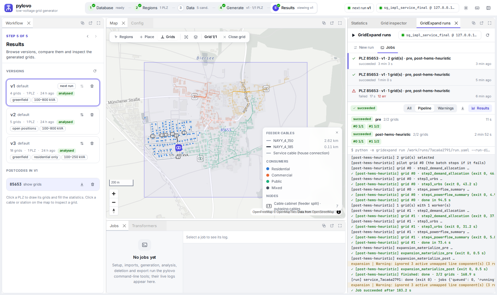
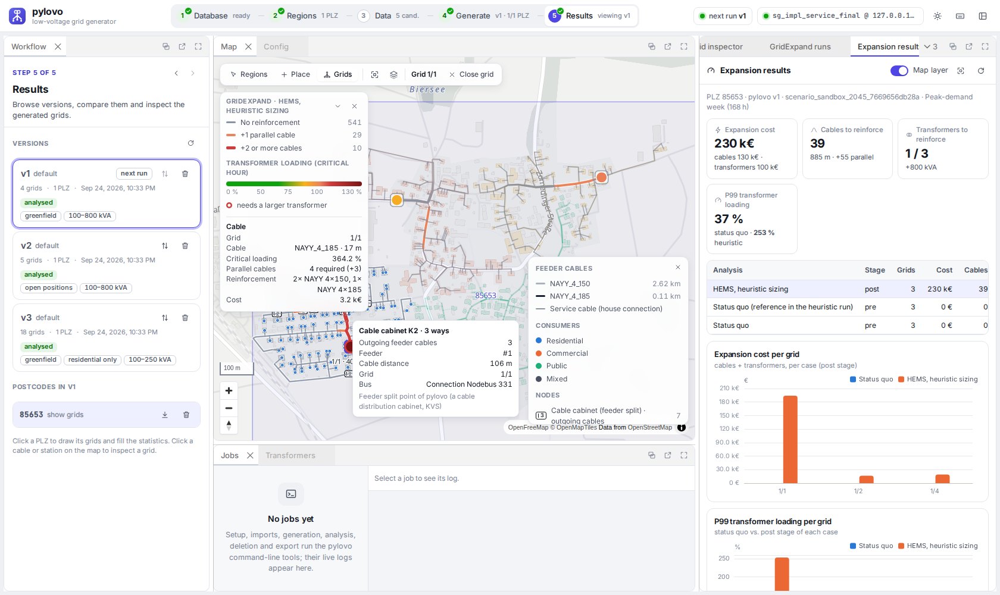

# GridExpand service and pylovo-ui plugin

`gridexpand serve` runs a small web service: a **job API** that starts the ordinary synthetic
pipeline (`gridexpand run`) as subprocesses, **read endpoints** for expansion analyses and
power-flow summaries, and the **plugin panels** that pylovo-ui loads (one UI for "generate LV grids,
then allocate loads, optimise, run power flow and analyse grid expansion"). The composition of both
tools (proxy, images, compose) lives in the GridPlanner repository.



## Run it

```bash
uv sync --extra service
uv run gridexpand serve                      # http://127.0.0.1:18766/  (API docs: /docs)
uv run pylovo-ui --plugin gridexpand=http://127.0.0.1:18766/   # in the pylovo checkout (development)
```

For the cross-origin development setup above start the service with
`GRIDEXPAND_UI_CORS_ORIGINS=http://127.0.0.1:8765`. Behind a reverse proxy (GridPlanner) use
`--root-path /gridexpand --allowed-host 127.0.0.1:18780`. Options: `--host`, `--port`, `--root-path`,
`--allowed-host` (repeatable), `--scenario-dir` (repeatable), `--max-running-jobs`, `--log-level`.
Environment: `GRIDEXPAND_SOLVER` (passed to the jobs), `GRIDEXPAND_SERVICE_SCENARIO_DIRS`
(`os.pathsep`-separated extra scenario folders), `GRIDEXPAND_UI_CORS_ORIGINS` (development only), and
the usual `GRIDEXPAND_ENV_FILE` / `GRIDEXPAND_WORK_DIR`.

**Safety.** The service starts jobs that write to the database of GridExpand's `.env`. It binds to
`127.0.0.1`, accepts only the `Host` headers `127.0.0.1:<port>`, `localhost:<port>` and the
`--allowed-host` values (DNS rebinding), and refuses every state-changing request without the header
`X-GridExpand-UI: 1` (CSRF). Its own database reads use read-only transactions with a 5 s connect
and 60 s statement timeout. There is no destructive endpoint.

## Jobs

A pipeline job is one generated run YAML (`pipeline: synthetic`, written to
`WORK_DIR/runs/<job>/run.yaml`) and one `gridexpand run` step per selected model case, one after
another (`gridexpand.service.commands.pipeline_steps`, the only place that builds the command lines):

```text
python -m gridexpand run WORK_DIR/runs/<job>/run.yaml --run-dir WORK_DIR/runs/<job> --model-case <case>
```

The run YAML holds the region (`ags`, `pylovo_version_id`, `min_buildings`, optional `start_index`
/ `limit`), the scenario file and the execution settings (`model_cases`, `timeframe_mode`,
`powerflow_output: summary`, `workers`, `pilot_index`). The steps share the run identity,
`state.json` and one regional electrification assignment; each case's batch writes
`WORK_DIR/runs/<job>/<case>/` (`events.jsonl`, `status.tsv`, grid logs).

- Grids: all candidates of the AGS, of one PLZ, or a consecutive range of candidate numbers (the
  runner's numbering, `gridexpand.db.grids.list_grid_candidates`); the first selected grid is the pilot.
- Model cases: `pre`, `post-hems-heuristic`, `post-hems-optimized`. `post-inflex-heuristic` is not
  offered (the synthetic Step 2 writes no EV sessions). Post cases need Step 3 with the solver of
  `GRIDEXPAND_SOLVER` (`gurobi` default, or `appsi_highs`): the service refuses them when it is not
  usable (Gurobi: licence check with a model above the size limit of the licence bundled with
  gurobipy; HiGHS: `highspy` importable).
- At most `--max-running-jobs` (default 1) jobs run; later jobs wait in a queue.
- Each step runs in its own process group. Cancel sends SIGTERM to the group (the runner and every
  step it started), SIGKILL after 20 s. Finished grids keep their results, and a grid stopped during
  its power flow keeps its earlier ones: Step 4 writes a staging run and swaps it in only when it is
  complete (the service ignores leftover staging runs).
- Progress comes from the runner's `events.jsonl` in each case directory (before a batch starts, from
  `state.json`); the per-grid table from `status.tsv`. The job log shows the runner's events as readable lines plus the step logs of every
  grid (`#<grid> │ …`, muted). Metadata and logs are kept in `WORK_DIR/service/jobs/`; after a
  restart the history is reloaded and jobs that were still active are marked failed.

## HTTP API (version 1)

| Method | Path | Purpose |
| --- | --- | --- |
| GET | `/api/health` | liveness (no database) |
| GET | `/api/status` | database, schema, pylovo versions with grid counts, solvers, large inputs, disk, jobs |
| GET | `/api/scenarios` · `/api/scenarios/{name}` | scenario YAMLs (id, year, heat source, adoption shares, hash, scenario key) · text |
| GET | `/api/grids?ags=&plz=&pylovo_version_id=&min_buildings=` | candidate grids with the runner's numbering and existing results |
| POST | `/api/jobs/pipeline` | queue a pipeline job (`plz`/`ags`, `pylovo_version_id`, `scenario`, `model_cases`, `timeframe_mode`, `min_buildings`, `candidate_indexes`, `workers`, `powerflow_output`) |
| GET | `/api/jobs` · `/api/jobs/{id}` · `/api/jobs/{id}/log[?format=text]` · `/api/jobs/{id}/events` (SSE) | observe jobs |
| POST | `/api/jobs/{id}/cancel` | cancel |
| GET | `/api/jobs/{id}/files` · `/api/jobs/{id}/files/{path}` | run-directory files (events, status, summaries, grid logs) |
| GET | `/api/results/analyses?ags=&plz=&pylovo_version_id=` | `expansion_analysis_run` with totals (cost, cables/transformers to reinforce) |
| GET | `/api/results/analyses/{key}/grids` · `…/geojson` | per-grid totals · cables (`action` none/add_1/add_2plus) and transformers (EPSG:4326) |
| GET | `/api/results/powerflow?ags=&plz=&pylovo_version_id=&scenario_key=` | `powerflow_summary` per grid, model case and stage |
| GET | `/ui/manifest.json` · `/ui/plugin.js` · `/ui/panels/*.js` | the pylovo-ui plugin |

Reads use plain SQL on stable names (`pylovo.version`, `grid_result`, `municipal_register`;
`surrogrid.grid_case`, `scenario`, `powerflow_run`, `powerflow_summary`, `expansion_*`, and the QGIS
views `expansion_line_qgis_mv` / `expansion_transformer_qgis_mv` for geometry). The model case of a
result is taken from its power-flow run name (`<scenario key>_<profile>_<case>_<mode>_powerflow`).

## Plugin panels

`ui/manifest.json` = `{"schema": 1, "name": "gridexpand", "entry": "ui/plugin.js", "api": "api/",
"csrf_header": "X-GridExpand-UI", …}`; `plugin.js` registers two panels with pylovo-ui's host API 1
(see pylovo's `frontend/README.md`, section Plugins) and a map layer:

- **GridExpand runs** — region from pylovo's selection (PLZ, pylovo version, the inspector's grid),
  candidate grids, scenario, model cases, timeframe; jobs with per-case and per-grid progress, the
  live log (SSE) and cancel.
- **Expansion results** — analyses of the region, KPIs (cost, cables and transformers to reinforce,
  P99 transformer loading per case), cost and P99 loading per grid and case (ECharts), per-grid
  table (click: pylovo's grid inspector), and the **map layer** on pylovo's MapLibre map: cables
  coloured by the required action, transformers by their loading in the critical hour, with a
  legend card that shows the hovered feature.



## Container

`docker/Dockerfile` (python:3.12-slim + uv, `uv sync --locked --no-dev --extra service`) and
`docker/compose.yaml` (standalone service, host networking, runs as your uid). Mounted at run time:
`.env` (read-only, `GRIDEXPAND_ENV_FILE`), `work/`, `config/`, and the untracked large inputs as
explicit read-only file mounts (`elec_lps.h5`, the two mobility pool CSVs). Step 3 in a container:
`GRIDEXPAND_SOLVER=appsi_highs` (HiGHS, in the image, no licence) runs every case; `gurobi` uses
gurobipy (Pyomo's `gurobi` interface falls back to it when `gurobi.sh` is absent) and needs a Gurobi
WLS licence file (`WLSACCESSID`, `WLSSECRET`, `LICENSEID`) mounted read-only with `GRB_LICENSE_FILE`
pointing to it. The heuristic case is a degenerate LP and the optimised case a MIP stopped at a 5 %
gap, so HiGHS and Gurobi can return different, equally optimal solutions; the solver is recorded in
`urbs_out/solver_audit` and belongs to the scenario when results are compared.

## Tests

```bash
uv run pytest tests/service                                                       # no database
GRIDEXPAND_SERVICE_TEST_DATABASE=<sandbox db of .env> uv run pytest tests/service  # + read-only DB tests
```
